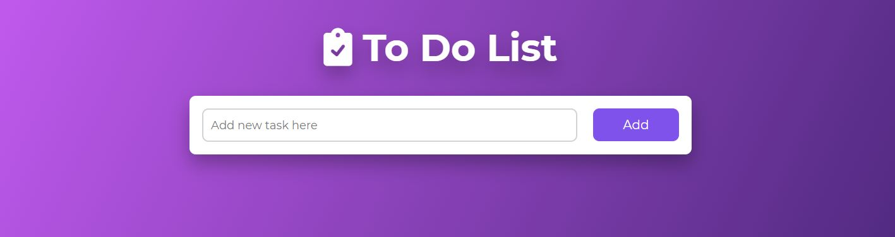

  <h1>To-Do List</h1>
  
  
 

<!-- ABOUT THE PROJECT -->
## About The Project
Simple "To Do" application to organize and prioritize your tasks

  

    <a href="https://app-todo-visual.glitch.me">View Demo Here</a>
  

## Built With

[HTML5](https://www.w3schools.com/html/) / [CSS3](https://www.w3schools.com/css/) / [JavaScript](https://www.w3schools.com/js/)
 

<!-- USAGE EXAMPLES -->
## Usage
Simple and easy to use application with a modern design. 
A user can add a task, mark a task as completed and delete an already added task. 
Application is responsive for mobile devices.

Project Link: https://github.com/kateFrontend/To-Do-app

